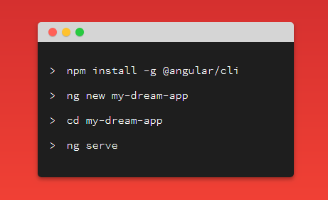

# Learning Angular 

## Create a new project and run the server 

## Make a new component 
`ng g c courses`

* Angular has component, directive, module,... Components becomes part of module. Directives are used to manipulate
  HTML DOM.
