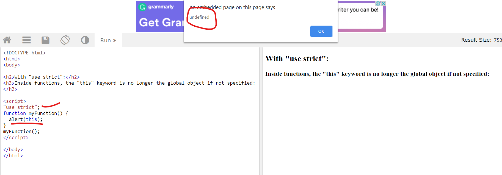

# Day 4

## New things learned today.

1. `"use strict;"` 

2. Arrow function.

3. Classes 

---

* **"use strict;"**

1. When we use strict in our script, our code maybe lets say *starts performing more sanely* if you will.
   You can use a variable without declaring it. 

2. Strict mode changes previously accepted "bad syntax" into real errors.

3. Deleting a function, a undeletable object wont be allowed.

4. Even `this` keyword behave differently in strict mode, Eg: if the object is not specified `this` will return `undefined`,
   but w/o strict mode, it will return a global object. 

5. In the picture given below, w/o strict mode, it will return global object (window) here.
 

 </img>

---

* **Arrow function**

1. Arrow function is just like normal function, but with reduced syntax.

2. For eg: noram function we would write something as `var x = function() { console.log("Hello..."); }`.
   Arrow function, we'd just write `var x - ()=>{ console.log("Hello..."); }`

3. With a regular function *this* represents the object that calls the function.

4. With an arrow function *this* represents the owner of the function.

---

* **Classes**

1. JS also provides us with the facility of making classes to make objects.\

2. Classes in JS are nothing but functions.

