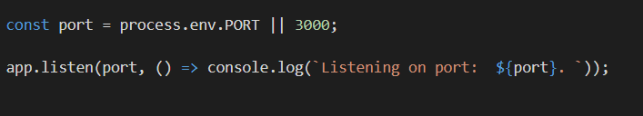

# Express 

## What is express according to me.

Express is a tool that we use in our Node environment in order to maintain and easily execute API requests and its logics.
We use **Joi** in express as well to easily validate our CRUD operation's data.

---
## Points

1. Install express and init.  `npm init --yes`  -> `npm i express`

2. You must have node modules and package.json files now. So create a new file for the server code.

3. Import express and listen to the port (3000 preferably). Dont forget to dynamically allocate the port.

    

4. Start making CRUD statements and give logic using **Joi**. 

5. Dont forget to use **NodeMon** or else everytime you update the code you will have to restart the server.

6. Also, use **POSTMAN** for Post and Put operations.

