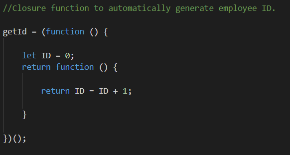

# Day 8 

## Learned about CLOSURE function today 

1. **Closure function is a function which has access to parent's scope even after the parent is no longer of use**

2. For eg: Suppose we want to count how many times a function was called. We can create a global variable and increment it
   every time the function is called. But the problem here is the variable is global, so it can be changed accidently. 
   So we can give our counter variable a scope i.e we can put it inside a function. Now there is another problem,
   Every time we call that function to increment our counter, our counter gets initialized again. We dont want that.
   We want our counter to initialize only once and then do the job of incrementing.

3. The above problem could have been easily solved by *static* keyword of JAVA, but we dont have that here.

4. Closures come to help here. We can define a *self-calling* function, which will execute automatically(call itself) while the 
   code is being loaded. Inside that  function we can have our counter variable which we will set to 0. 

5. In JS script a function can access scope of function above it. So inside our automatic function we can define another function 
   whose job is to increment our variable. This is closure function.

