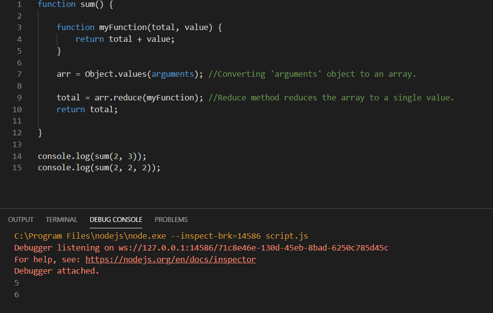

# Day 9

## Learned today

1. Javascript functions do not care about the arguments passed to it.

2. Functions have an inbuilt object called 'arguments' which has a property called 'length' that can give us the
   length of the arguments. And we can even access it by `arguments[i]`.

3. So today I had 'add()' function with no arguments and its job was to add any number of arguments given to it.
   I first converted the 'arguments' object to an array using `Object.values(arguments)`. And then used 'reduce' function 
   on the array to reduce it to single value which is the total value.

4. 